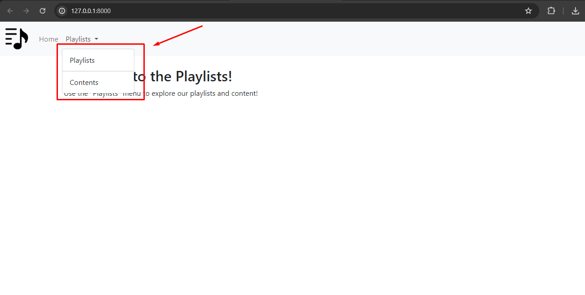

## SectoTeca Project

Welcome to the SectoTeca project, developed by me ©Jessé Jorge Santana.

I hope you enjoy the experience! :smile:

*If you want to watch the video presentation of my project, please click <a href="https://youtu.be/EYdl_-iHen8">here</a>.*

I made this simple documentation to help you install and run this project: :computer: :gear:

If you need help or have any questions, please don't hesitate to get in touch with me. Here are some ways to get in touch with me:

📞 - WhatsApp: +55 (11) 99335-5997
📧 - E-mail: jesse-jjs@hotmail.com

### Installation and Execution

**First of all**, you will need to create a copy of the `.env.example` file and rename it to `.env`.
Then you can follow one of the steps below as desired

#### Without Docker

##### System Requirements

* PHP 8.3.^
* MySQL 8.^
* Composer 2.5.^

##### Step-by-step

Configure the following variables in your `.env` file for database configuration:

```
DB_CONNECTION=mysql
DB_HOST=127.0.0.1
DB_PORT=3306
DB_DATABASE=sectoteca
DB_USERNAME=root
DB_PASSWORD=root
```
Run these commands in your terminal when you are in the root of the project:

```
composer i
php artisan key:generate
php artisan migrate
php artisan serve --port=8080
```
If you want a completed test base, run the following command to run the project's factories:

```
php artisan db:seed
```
#### With Docker
This project uses Laravel Sail, so the official documentation can be of great help too, to access it click <a href="https://laravel.com/docs/10.x/sail">here</a>.

Below is a summarized step-by-step guide for using Sail with Docker
##### System Requirements
* Docker
* **For Windows**: WSL2

##### Step-by-step
Configure the following variables in your `.env` file for database configuration:

```
DB_CONNECTION=mysql
DB_HOST=mysql
DB_PORT=3306
DB_DATABASE=sectoteca
DB_USERNAME=sail
DB_PASSWORD=password
```
If you use Sail, please keep the username `sail` and the password as `password`. In the case of Sail, ensure that no other applications are using port `3306` for the MySQL database.

If you are using Linux and are using Docker Desktop you must run the following command. If you are not using Docker Desktop for Linux, you may skip this step.
```
docker context use default
```
To install the project dependencies you must run the following command:
```
docker run --rm \
    -u "$(id -u):$(id -g)" \
    -v "$(pwd):/var/www/html" \
    -w /var/www/html \
    laravelsail/php83-composer:latest \
    composer install --ignore-platform-reqs
```
This Docker command will use the latest php and composer image to install the project's dependencies, generating the vendor folder.

After then you must execute the following command:
```
./vendor/bin/sail up -d
```
This command will launch the execution environment.

To execute all artisan commands, they must all be preceded by the instruction `./vendor/bin/sail`, as shown in the example below:
```
./vendor/bin/sail artisan key:generate
./vendor/bin/sail artisan migrate
```
If you want a completed test base, run the following command to run the project's factories:

```
./vendor/bin/sail artisan db:seed
```

To close the project execution via Sail you will need to execute the following command:
```
./vendor/bin/sail down
```

### Expected Outcome

If you followed one of the steps listed above, the expected result will be to see the following screen on your localhost on port `8080`:



You can use the "SectoTeca" menu to register playlists and content.